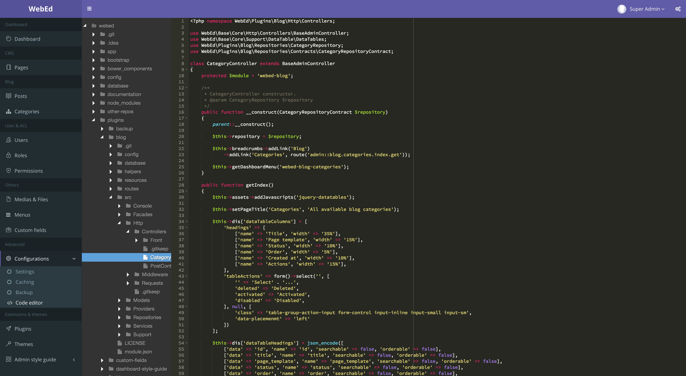

#WebEd IDE
An online IDE for WebEd cms.

###License
GNU GENERAL PUBLIC LICENSE

####Only super admin can access.

###How to use?
Go through to **Admin Dashboard** --> **Plugins** --> Enable and install this plugin.

###Risks
Edit project online may occur some security issues. Be careful!

###Demo

###Keyboard shortcuts
- Save file: 
    - Mac: **Command** + **s**
    - Windows & others: **Ctrl** + **s**
- Close file: 
    - Mac: **Command** + **d**
    - Windows & others: **Ctrl** + **d**